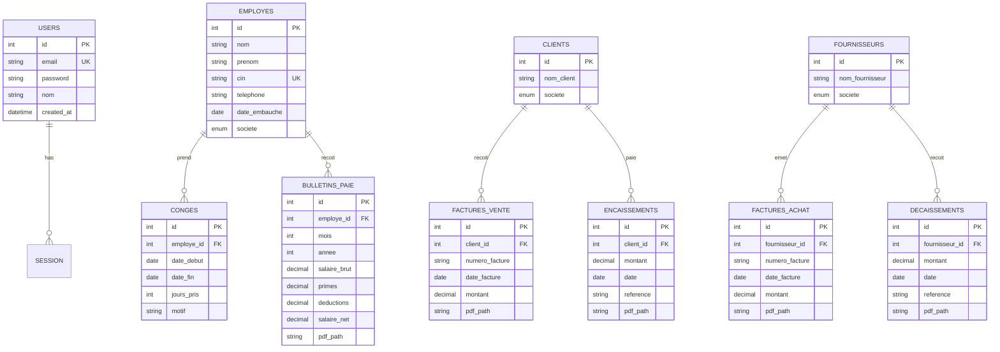

# Schéma de base de données - Beta ERP

## Diagramme ER



## Enum Societe

- `OXYRAL` — Prestations de peinture industrielle
- `CHIMIRAL` — Fabrication et vente de peintures

## Règles métier - Congés

| Ancienneté | Droit annuel |
|------------|--------------|
| < 1 an | 9 jours |
| ≥ 1 an | 18 jours |

- Les **dimanches** ne sont pas comptabilisés
- `jours_pris` = jours ouvrés entre `date_debut` et `date_fin`
- `solde_restant` = `droit_annuel` - SUM(`jours_pris`)

## Stockage PDF

```
backend/storage/pdfs/
├── bulletins/
├── factures/
│   ├── achat/
│   └── vente/
└── traites/
    ├── encaissement/
    └── decaissement/
```
